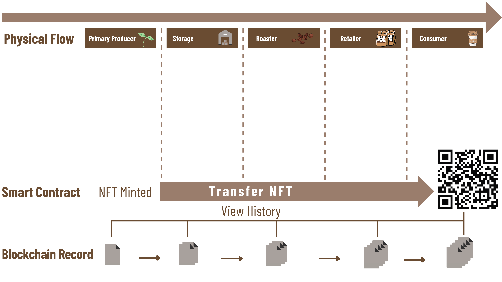

# Coffee_Supply_Chain - DRAFT README.md

## Contents
1. [Overview of the Project](#overview-of-the-project)
2. [Technologies Used](#technologies-used)
3. [Getting Started](#getting-started)
    * [Installing](#installing)
4. [User Interface](#utilising-the-user-interface)

---
## Overview of the Project

This project aims to solve the problem of tracking the full supply chain from the production of coffee beans to the consumer hands.

Utilising a Streamlit front end this supply chain tracks the transactions and movement of coffee beans from:
* Harvester
* Storage
* Roaster
* Retailer
* Consumer

Ultimately allowing the end user (consumer) to scan a QR code enabling them to access the full history of the supply chain of a specific bag of coffee.

## Technologies Used

* [RemixIDE](https://remix-project.org/)
* [Web3](https://web3py.readthedocs.io/en/stable)
* [Streamlit](https://streamlit.io/)
* [Dotenv](https://pypi.org/project/python-dotenv/)
* [Python 3.7]()
* [QR Code](https://pypi.org/project/qrcode/)
* [Ganache](https://trufflesuite.com/ganache/)
* [Metamask](https://metamask.io/)

## Getting Started
### Installing
**A step by step series of examples on how to install this application:**

	git clone https://github.com/aaargyrou/Coffee_Supply_Chain.git

Ensure all technologies have been installed:

    pip install streamlit
    pip install qrcode
    pip install web3
    pip install python-dotenv

## Utilising the User Interface
**A step by step series of examples on how to use this application:**

Navigate to the folder

    cd Coffee_Supply_Chain

Run the Streamlit Application

    streamlit run app.py

